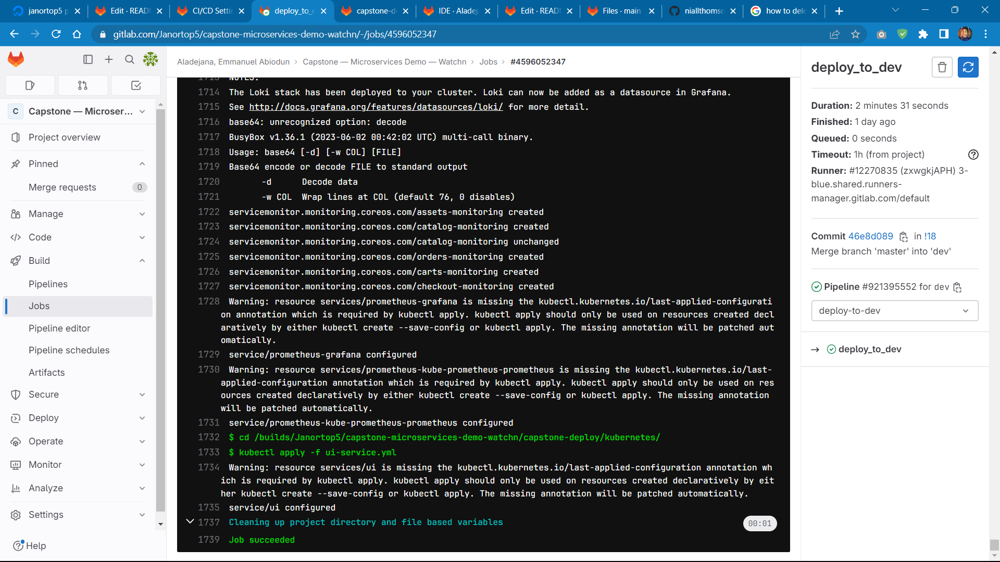

# Capstone Project - Deploy Watchn

### Watchn Application
Link to Application repo: https://github.com/niallthomson/microservices-demo

### prerequisites for project
- aws account
- iam user with administrator access
- domain
- dockerhub account
- gitlab account

### prerequisites for pipeline
- remote backend for terraform state — a sample file to create s3 backend available in ./capstone-deploy/terraform/remote.tf
- namedotcom token
- create the following variables in gitlab:
```
AWS_ACCESS_KEY_ID   [variable.type: env_var]
AWS_CREDENTIALS     [variable.type: env_var]
AWS_DEFAULT_REGION  [variable.type: env_var]
REGISTRY_PASS       [variable.type: env_var]
REGISTRY_USER       [variable.type: env_var]
```


## Breakdown
#### stage: infrastructure
- uses 'zenika/terraform-aws-cli:release-6.0_terraform-1.3.7_awscli-1.27.60' image to connect to aws and run terraform configuration
- takes in the following variables in the 'before_script' argument: AWS_ACCESS_KEY_ID, AWS_SECRET_ACCESS_KEY, AWS_DEFAULT_REGION
- script argument runs terraform configuration
- creates artifacts
#### stage: test
- uses 'docker:23.0.1-cli' image and it's 'docker:23.0.1-dind' service 
- takes in variable: DOCKER_TLS_CERTDIR: "/certs"
- has a before_script argument to install bash
- 'script' runs the test script
#### stage: build
- 
#### stage: deploy-to-dev
- contains the "deploy-to-dev" job
- deploys watchn, prometheus and loki to dev environment cluster before production

#### stage: deploy-to-prod
- contains the "deploy-to-prod" job
- deploys watchn, prometheus and loki to production

#### How pipeline works
**stage 'infrastructure':** 
- contains the infrastructure job
- deploys and sets up cluster with terraform
- creates artifacts for credentials to connect to cluster in later jobs
- contains the get_cluster_credentials job which is to only get the cluster credentials from terraform after cluster has been created 


**stage 'test':**
- contains the "run_tests" job
- it builds the images for the source codes and tests the application before the build stage (the tests provided by the developers for the application failed, hence why it was skipped in the pipeline)


**stage 'build':**
- contains the "build_images" job
- builds the images for the various microservices (ui, catalog, carts, orders, checkout, assets, activemq) and pushes to dockerhub account


- **stage 'deploy':** 
```
- setup Gitlab runner with the following Binary:
  • terraform
  • aws cli 
  • aws-iam-authenticator
  • helm
- deploys terraform configuration and kubernetes manifests
```
