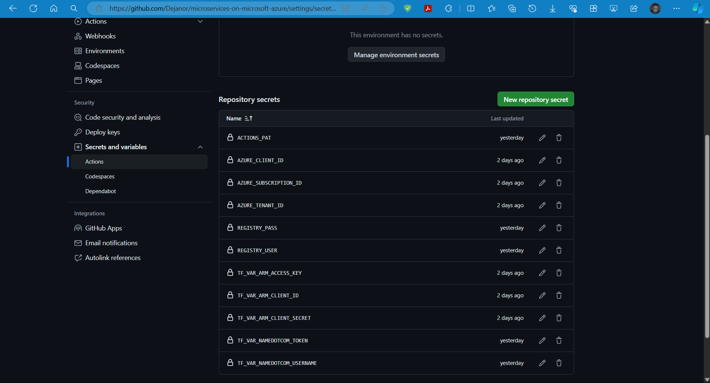
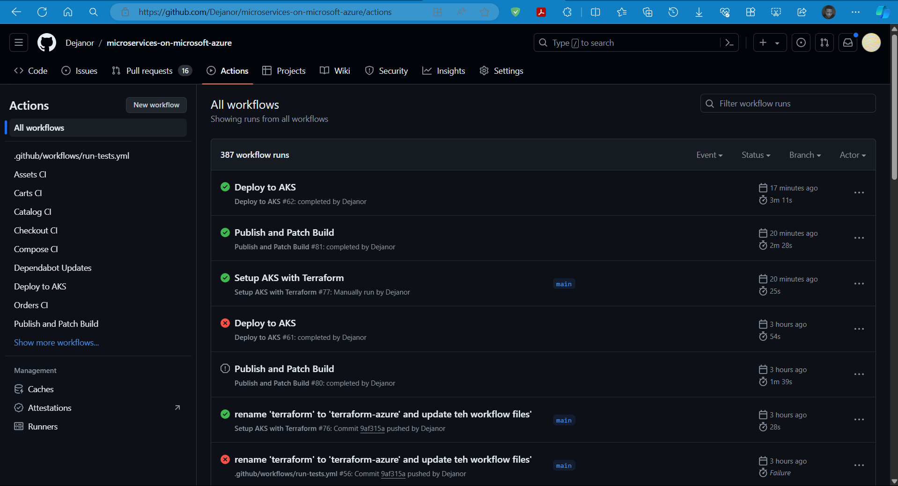
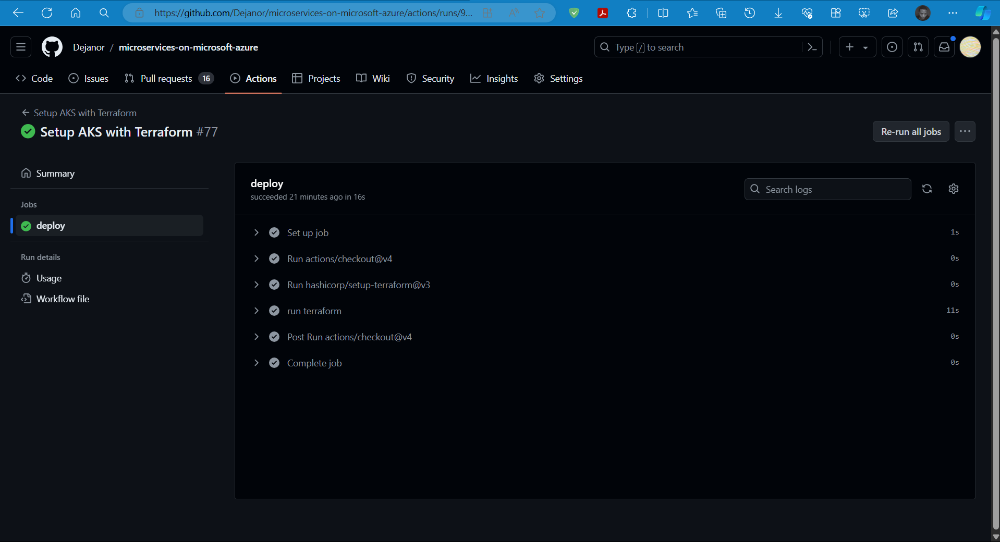
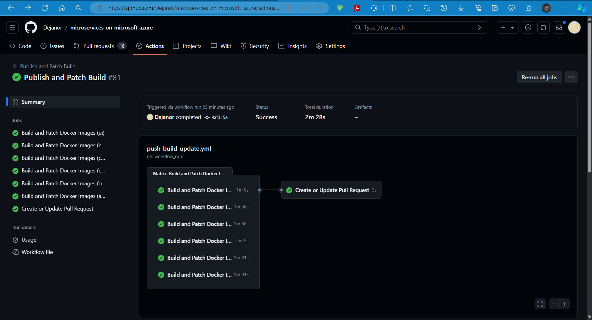
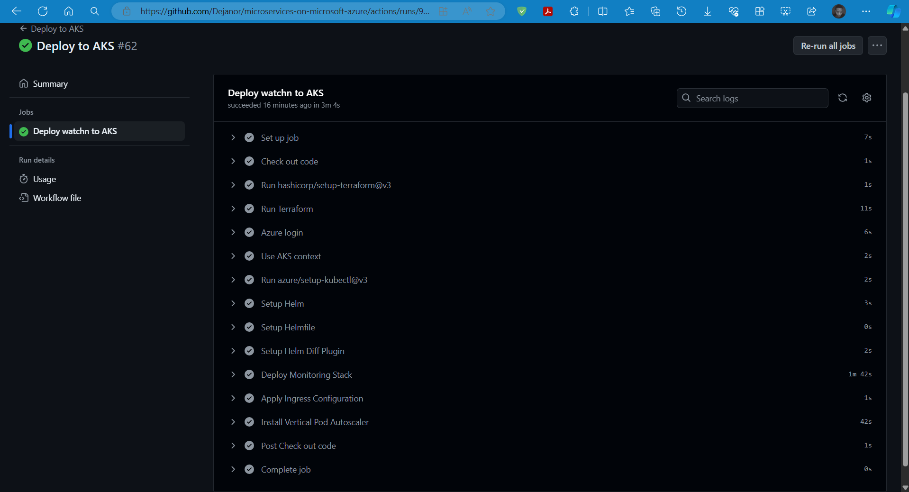
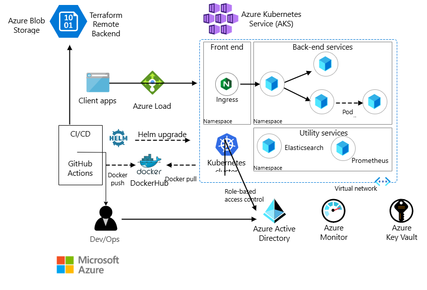
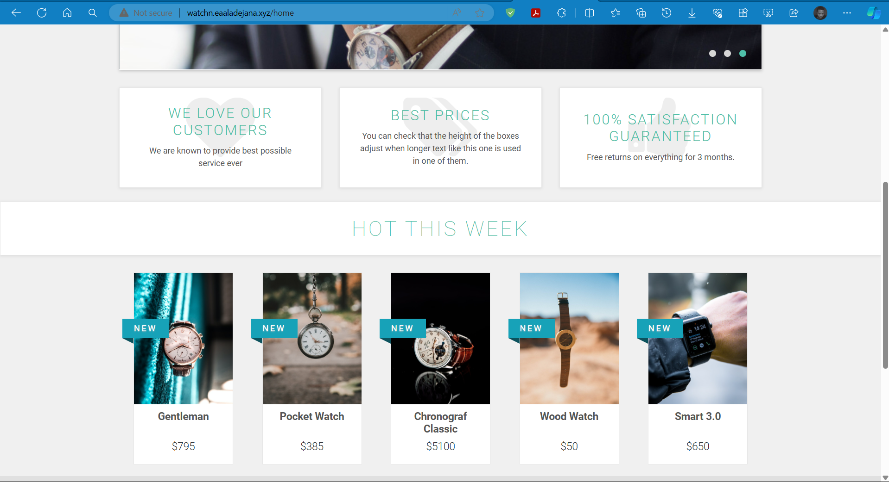
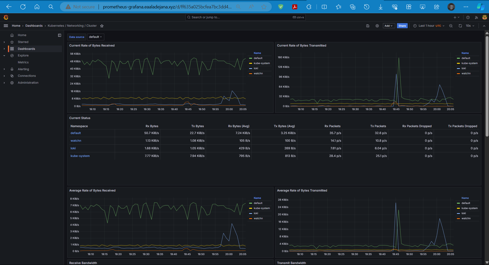
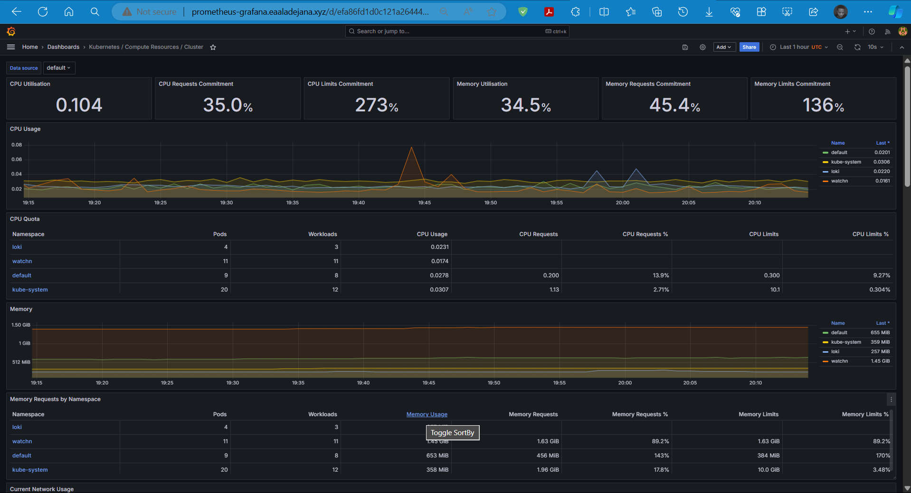
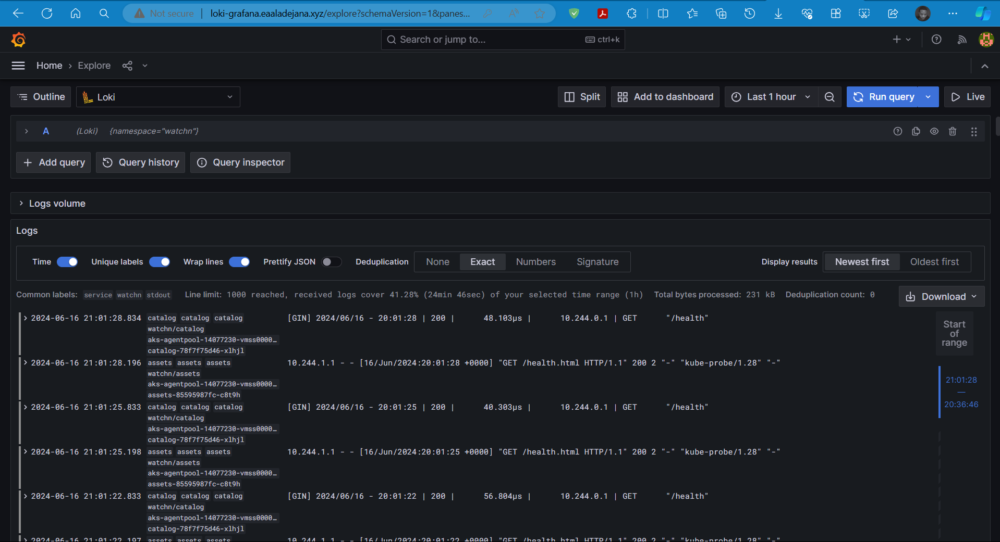

# Capstone Project - Deploy Watchn

### Watchn Application
Link to Application repo: https://github.com/niallthomson/microservices-demo

### prerequisites for project
- A Microsoft Azure Account with a valid subscription (preferable 'basic' at minimum)
- namedotcom domain
- dockerhub account
- github actions

### prerequisites for pipeline
- remote backend for terraform state — terraform configuration for Azure blob storage remote backend in terraform-azure/remote
- namedotcom token
- create the following Repository secrets in repository settings under 'Secrets and Variables/Actions':
```
- ACTIONS_PAT
- AZURE_CLIENT_ID
- AZURE_SUBSCRIPTION_ID
- AZURE_TENANT_ID
- REGISTRY_PASS
- REGISTRY_USER
- TF_VAR_ARM_ACCESS_KEY
- TF_VAR_ARM_CLIENT_ID
- TF_VAR_ARM_CLIENT_SECRET
- TF_VAR_NAMEDOTCOM_TOKEN
- TF_VAR_NAMEDOTCOM_USERNAME
```


## Breakdown
#### Workflow: infrastructure.yml (Setup AKS with Terraform)
- uses ubuntu-latest github actions runner
- job **deploy**: uses 'actions/checkout@v4', 'hashicorp/setup-terraform@v3', 'actions/upload-artifact@v3'
- creates **aks cluster** with **terraform configuration**
- contains **terraform command** to **destroy resources** and **remove from state**
- creates and uploads **artifacts**
#### Workflow: push-build_update.yml (Publish and Patch Build)
- uses ubuntu-latest github actions runner
- job **build_and_patch**, **Create or Update Pull Request**
- builds services and push to dockerhub account
- create pull request
#### Workflow: **deploy-to-aks.yml' (Deploy to AKS)
- uses ubuntu-latest github actions runner
- job **deploy_to_aks**
- uses **actions/checkout@v3** **docker/login-action@v2** **peter-evans/create-pull-request@v4**
- initializes terraform to get terraform outputs
- logs in to Azure, sets up AKS context, Kubectl, Helm, Helmfile, Helm Diff Plugin, Helm repository
- apply all manifests
## What pipeline does
#### ACTIONS PAGE

#### Workflow 'Setup AKS with Terraform'
- **deploys** and **sets up cluster** with terraform


#### Workflow 'Publish and Patch Build'
- **builds** the **images** for the **various microservices** (ui, catalog, carts, orders, checkout, assets, activemq) and pushes to dockerhub account


#### Workflow 'Deploy to AKS'
- deploys **watchn, prometheus** and **loki** on **AKS Cluster**

### Pipeline Diagram

## Infrastructure
#### ./capstone-deploy/terraform-azure
- creates aks cluster
- sets **remote backend** as azure blob storage
- creates **azure dns record**
- creates **nginx-ingress-controller** for aks clusters

## configuration
#### ./deploy/kubernetes
- deploys **watchn** application using **helmfile, helm charts** and **helm-diff plugin**
#### ./capstone-deploy/kubernetes
- **'./ingress/loki-ingress.yml'** - ingress configuration for loki (logging)
- **'./ingress/prometheus-grafana-ingress.yml'** - ingress configuration for prometheus grafana ui
- **'./monitoring/assets-service-monitor.yml'** - service monitor configuration for assets microservices, prometheus now able to see and scrape metrics
- **'./monitoring/carts-service-monitor.yml'** - service monitor configuration for carts microservices, prometheus now able 
- **'./monitoring/catalog-service-monitor.yml'** - service monitor configuration for catalog microservices, prometheus now able 
- **'./monitoring/checkout-service-monitor.yml'** - service monitor configuration for checkout microservices, prometheus now able 
- **'./monitoring/orders-service-monitor.yml'** - service monitor configuration for orders microservices, prometheus now able
- **'./monitoring/ui-service-monitor.yml'** - service monitor configuration for ui microservices, prometheus now able
prometheus-grafana-service.yml - 
- **'./monitoring/prometheus-service.yml'** - service configuration for prometheus deployment
- **'./monitoring/prometheus-grafana-service.yml'** - Load Balancer service configuration for prometheus grafana ui service
- **'deploy.sh'** - script to deploy all the configurations on both staging and production clusters
- **'ui-service.yml'** - Load Balancer service configuration for watchn ui service
- **'./ingress/ui-ingress.yml'**- ingress configuration for watchn ui 
- **'install-vpa.sh'** - script to install Vertical Pod Autoscaler (VPA) on cluster
- **'vpa-auto-mode.yml'** - configuration to set 'updateMode: auto' for VPA
## Steps to recreate
- get a **namedotcom** domain and create an api token
- get an **azure account** with at minimum a **basic** subscription
- get a **dockerhub account** with its **username** and **password** as **"REGISTRY_USER"** and **"REGISTRY_PASS"** stored as github secrets 
- create a remote backend using **terraform/remote/**
- uncomment needed commands
- run pipeline with push or workflow dispatch
## Security
- hid sensitive credentials using github secrets
- Actions PAT for GitHub pull requests permission
- 'main' branch protection
- set appropriate permissions for the different users according to their role
## Autoscaling
- making use of **Vertical Pod Autoscaler (VPA)** to scale kubernetes cluster according to historical resource usage measurements
- Adds more CPU and Memory to pods by adjusting the resource requests and limits for pods
## Watchn app ui

## prometheus monitoring and metrics



## loki logging



